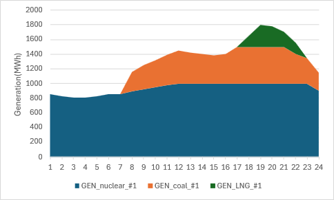

# User Tutorial

* 이 장에서는 OPEN에서 제공하고 있는 다양한 기능들을 사용자가 터득하는데 돕기 위해 다양한 튜토리얼을 제공한다. 직관적인 설명을 위해 가장 간단한 toy example을 사용하며, 단기전원계획부터 시작하여 장기운영계획까지 모의해본다. toy example별로 입력데이터 파일들과 시나리오 정보 파일도 별도로 제공하니 다운로드를 받아서 직접 시뮬레이션을 돌려볼 것을 권장한다. 다만, 앞서 설명했듯이 OPEN은 입력데이터와 시나리오 설정에 있어 다양한 방법을 제공하기 때문에 첨부파일은 하나의 예시에 불과하며 다양한 방법을 통해 OPEN을 사용할 수 있다.

## 단기 운영계획 - 간단한 기동정지계획

### [Problem definition – sub_scenario_1]

* 단일 모선에 원자력, 석탄, LNG 발전기가 각각 1대씩 건설되어 있다고 가정한다. 발전기의 주요 파라미터에 대한 정보는 아래 표와 같다.


<div style="overflow-x: auto; text-align: center;">
<style>
table.dataframe {
    margin-left: auto;
    margin-right: auto;
}
.dataframe thead th,
.dataframe th,
.dataframe td {
    text-align: center !important;
}
</style>
<table border="1" class="dataframe dataframe">
<thead>
    <tr style="text-align: right;">
    <th>name</th>
    <th>carrier</th>
    <th>p_nom</th>
    <th>min_up_time</th>
    <th>min_down_time</th>
    <th>ramp_limit_up</th>
    <th>ramp_limit_down</th>
    <th>marginal_cost</th>
    </tr>
</thead>
<tbody>
    <tr>
    <th>GEN_nuclear_#1</th>
    <td>nuclear</td>
    <td>1000</td>
    <td>8</td>
    <td>12</td>
    <td>0.03</td>
    <td>0.03</td>
    <td>5000</td>
    </tr>
    <tr>
    <th>GEN_coal_#1</th>
    <td>coal</td>
    <td>500</td>
    <td>8</td>
    <td>12</td>
    <td>0.40</td>
    <td>0.40</td>
    <td>50000</td>
    </tr>
    <tr>
    <th>GEN_LNG_#1</th>
    <td>LNG</td>
    <td>500</td>
    <td>4</td>
    <td>3</td>
    <td>0.90</td>
    <td>0.90</td>
    <td>100000</td>
    </tr>
</tbody>
</table>
</div>

* 2025년 1월 1일 하루 동안의 수요(단위:MWh)가 아래 그림처럼 주어졌을 때 발전기의 기동정지계획을 모의해본다.

    <div style="overflow-x: auto; text-align: center;">

    <style>
    table.dataframe {
        margin-left: auto;
        margin-right: auto;
    }
    .dataframe thead th,
    .dataframe th,
    .dataframe td {
        text-align: center !important;
    }
    </style>

    <table border="1" class="dataframe dataframe">
        <thead>
            <tr>
                <th>1h</th>
                <th>2h</th>
                <th>3h</th>
                <th>4h</th>
                <th>5h</th>
                <th>6h</th>
                <th>7h</th>
                <th>8h</th>
                <th>9h</th>
                <th>10h</th>
                <th>11h</th>
                <th>12h</th>
                <th>13h</th>
                <th>14h</th>
                <th>15h</th>
                <th>16h</th>
                <th>17h</th>
                <th>18h</th>
                <th>19h</th>
                <th>20h</th>
                <th>21h</th>
                <th>22h</th>
                <th>23h</th>
                <th>24h</th>
            </tr>
        </thead>
        <tbody>
            <tr>
                <td>860</td>
                <td>830</td>
                <td>810</td>
                <td>810</td>
                <td>830</td>
                <td>860</td>
                <td>860</td>
                <td>1160</td>
                <td>1250</td>
                <td>1320</td>
                <td>1390</td>
                <td>1450</td>
                <td>1420</td>
                <td>1400</td>
                <td>1380</td>
                <td>1400</td>
                <td>1500</td>
                <td>1650</td>
                <td>1800</td>
                <td>1780</td>
                <td>1700</td>
                <td>1550</td>
                <td>1350</td>
                <td>1150</td>
            </tr>
        </tbody>
    </table>

    </div>


### [Problem approach(input data) – sub_scenario_1]

* 입력데이터 설정에 있어 발전기에 대한 정보와 파라미터는 `test\SystemData\generators.csv`에 아래 그림과 같이 입력한다.

    <div style="overflow-x: auto; text-align: center;">

    <style>
    table.dataframe {
        margin-left: auto;
        margin-right: auto;
    }

    .dataframe thead th,
    .dataframe th,
    .dataframe td {
        text-align: center !important;
    }
    </style>

    <table border="1" class="dataframe dataframe">
    <thead>
        <tr style="text-align: right;">
        <th>name</th>
        <th>bus</th>
        <th>carrier</th>
        <th>committable</th>
        <th>start_date</th>
        <th>end_date</th>
        <th>p_nom</th>
        <th>p_min_pu</th>
        <th>p_max_pu</th>
        <th>nb_0</th>
        <th>min_up_time</th>
        <th>min_down_time</th>
        <th>ramp_limit_up</th>
        <th>ramp_limit_down</th>
        <th>marginal_cost</th>
        <th>parent_unit</th>
        <th>Const_ramping</th>
        <th>Const_start_up</th>
        </tr>
    </thead>
    <tbody>
        <tr>
        <th>GEN_nuclear_#1</th>
        <td>서울</td>
        <td>nuclear</td>
        <td>True</td>
        <td>2005-04-01</td>
        <td>2100-01-01</td>
        <td>1000</td>
        <td>0.8</td>
        <td>1</td>
        <td>1</td>
        <td>8</td>
        <td>12</td>
        <td>0.03</td>
        <td>0.03</td>
        <td>5000</td>
        <td>GEN_nuclear_#1</td>
        <td>fixed</td>
        <td>True</td>
        </tr>
        <tr>
        <th>GEN_coal_#1</th>
        <td>서울</td>
        <td>coal</td>
        <td>True</td>
        <td>2015-04-01</td>
        <td>2100-01-01</td>
        <td>500</td>
        <td>0.5</td>
        <td>1</td>
        <td>1</td>
        <td>8</td>
        <td>12</td>
        <td>0.40</td>
        <td>0.40</td>
        <td>50000</td>
        <td>GEN_coal_#1</td>
        <td>fixed</td>
        <td>True</td>
        </tr>
        <tr>
        <th>GEN_LNG_#1</th>
        <td>서울</td>
        <td>LNG</td>
        <td>True</td>
        <td>2015-01-01</td>
        <td>2100-01-01</td>
        <td>500</td>
        <td>0.3</td>
        <td>1</td>
        <td>1</td>
        <td>4</td>
        <td>3</td>
        <td>0.90</td>
        <td>0.90</td>
        <td>100000</td>
        <td>GEN_LNG_#1</td>
        <td>fixed</td>
        <td>True</td>
        </tr>
    </tbody>
    </table>

    </div>

* `test\SystemData\loads.csv`파일에서 모선에 연결된 부하명을 정의하여 입력하고, 해당 부하에 연결된 모선 정보를 입력한다.

    <div style="overflow-x: auto; text-align: center;">

    <style>
    table.dataframe {
        margin-left: auto;
        margin-right: auto;
    }

    .dataframe thead th,
    .dataframe th,
    .dataframe td {
        text-align: center !important;
    }
    </style>

    <table border="1" class="dataframe dataframe">
    <thead>
        <tr style="text-align: right;">
        <th>name</th>
        <th>bus</th>
        </tr>
    </thead>
    <tbody>
        <tr>
        <th>서울</th>
        <td>서울</td>
        </tr>
    </tbody>
    </table>

    </div>

* 시간대별 전력수요는 `\resources\scenarios\sub_scenario_1\loads-snapshots-p_set.csv`에 입력한다. 이때 부하명은 앞서 정의한 부하명과 일치하도록 적어줘야 한다.

    <div style="overflow-x: auto; text-align: center;">

    <style>
    table.dataframe {
        margin-left: auto;
        margin-right: auto;
    }

    .dataframe thead th,
    .dataframe th,
    .dataframe td {
        text-align: center !important;
    }
    </style>

    <table border="1" class="dataframe dataframe">
    <thead>
        <tr style="text-align: right;">
        <th></th>
        <th>서울</th>
        </tr>
    </thead>
    <tbody>
        <tr>
        <th>2025-01-01 0:00</th>
        <td>860</td>
        </tr>
        <tr>
        <th>2025-01-01 1:00</th>
        <td>830</td>
        </tr>
        <tr>
        <th>2025-01-01 2:00</th>
        <td>810</td>
        </tr>
        <tr>
        <th>2025-01-01 3:00</th>
        <td>810</td>
        </tr>
        <tr>
        <th>2025-01-01 4:00</th>
        <td>830</td>
        </tr>
        <tr>
        <th>2025-01-01 5:00</th>
        <td>860</td>
        </tr>
        <tr>
        <th>2025-01-01 6:00</th>
        <td>860</td>
        </tr>
        <tr>
        <th>2025-01-01 7:00</th>
        <td>1160</td>
        </tr>
        <tr>
        <th>2025-01-01 8:00</th>
        <td>1250</td>
        </tr>
        <tr>
        <th>2025-01-01 9:00</th>
        <td>1320</td>
        </tr>
        <tr>
        <th>2025-01-01 10:00</th>
        <td>1390</td>
        </tr>
        <tr>
        <th>2025-01-01 11:00</th>
        <td>1450</td>
        </tr>
        <tr>
        <th>2025-01-01 12:00</th>
        <td>1420</td>
        </tr>
        <tr>
        <th>2025-01-01 13:00</th>
        <td>1400</td>
        </tr>
        <tr>
        <th>2025-01-01 14:00</th>
        <td>1380</td>
        </tr>
        <tr>
        <th>2025-01-01 15:00</th>
        <td>1400</td>
        </tr>
        <tr>
        <th>2025-01-01 16:00</th>
        <td>1500</td>
        </tr>
        <tr>
        <th>2025-01-01 17:00</th>
        <td>1650</td>
        </tr>
        <tr>
        <th>2025-01-01 18:00</th>
        <td>1800</td>
        </tr>
        <tr>
        <th>2025-01-01 19:00</th>
        <td>1780</td>
        </tr>
        <tr>
        <th>2025-01-01 20:00</th>
        <td>1700</td>
        </tr>
        <tr>
        <th>2025-01-01 21:00</th>
        <td>1550</td>
        </tr>
        <tr>
        <th>2025-01-01 22:00</th>
        <td>1350</td>
        </tr>
        <tr>
        <th>2025-01-01 23:00</th>
        <td>1150</td>
        </tr>
    </tbody>
    </table>

    </div>


### [Problem approach(scenario file) – sub_scenario_1]

* 시나리오 정보 파일은 `config_test_1.yaml`로 정의한다. 해당 파일의 경로는 `\test\resources`에 위치해야 한다.
* 계획기간에 대한 정보는 snapshots의 하위블록으로 시작일과 종료일에 대해 작성한다. 이 때 유의해아 할 점은 end_date에 종료일을 작성할 때 실제 종료일의 1일 뒤 시점으로 작성해야 한다.
  
  ```yaml
    snapshots:
        start: 2025-01-01
        end: 2025-01-02
  ```

* 입력 데이터 경로에 대한 위치를 작성한다. 공통 입력데이터가 위치한 경로의 폴더명은 `csv_folder_name`에 작성한다. 시나리오 명에 대한 정보는 `scenario_name`에 작성한다. 시나리오 폴더의 경로는 `{input:scenarios}`에 resources 폴더부터 작성한다.

  ```yaml
    csv_folder_name: SystemData
    scenario_name : sub_scenario_1
    input:
    scenarios: resources/scenarios/sub_scenario_1
  ```

* 이 문제는 장기전원계획이 아닌 단기운영계획만 모의하기 때문에 `{planning:activate}`는 `False`로 작성해야 한다. 단기운영계획을 활성화하기 위해 `{operation:activate}`는 `True`로 작성해야 한다. `step_length`는 단기운영계획의 문제 풀이 단위를 의미하고 시간 단위로 작성해야하며, opt_window_length는 동시에 문제를 푸는 기간을 의미한다.

  ```yaml
    operation:
        activate: True

        step_length : 24
        opt_window_length: 1
    year_list:
  ```


### [Simulation – sub_scenario_1]

* `test` 폴더에 모델 실행을 위한 파이썬 파일을 생성해야 하며, 본 예시에서는 `test\main_test.py`을 생성한다. 새롭게 생성한 파일에서 아래처럼 입력하여 시뮬레이션을 수행한다. 앞서 작성한 시나리오 정보파일과 단기 운영계획을 모의하는 모듈을 입력하고, 해당 파이썬 파일을 실행하여 시뮬레이션을 수행할 수 있다. 참고로 OPEN에서 단기 운영계확만 모의하는 모듈은 `run_operation `이므로 해당 모듈을 이용하면 된다.

    ```python
    from open import Network
    from open._helpers import call_config

    import time

    if __name__ == '__main__':
        yaml_file_names = f"resources/config_test_1.yaml"

        kwargs = {}


        config = call_config(yaml_file_names)
        n = Network()
        n = n.module.run_operation(config, **kwargs)

    ```

### [Results – sub_scenario_1]

* 단기운영계획인 sub_scenario_1에 대한 축약적인 결과는 `\SystemData\results\sub_scenario_1\summary_short_term_sub_scena`rio_1_2025.xlsx`에서 제공한다. 구체적인 결과는 \test\SystemData\results\sub_scenario_1\ST_2025`에서 각 항목별 파일로 제공한다. 특히, 시간대별 발전기별 출력량은 해당 경로에서 generators.csv파일을 통해 확인할 수 있으며 아래 그림과 같다.

    


### [Problem definition – sub_scenario_2]

* 앞선 sub_scenario_1을 기반으로 안정적인 계통 운영을 위해 상향 예비력에 대한 요구량이 추가되었다고 가정한다. 계획기간동안 140MW의 예비력을 만족시켜야 할 때 발전기의 기동정지계획을 모의해보자. 단, 모든 발전기가 예비력 요구조건을 응동할 수 있다. 앞선 예제와 구분하기 위해 여기서 다루는 시나리오를 sub_scenario_2로 정의하였다.

### [Problem approach(input data) – sub_scenario_2]

* 사용자의 편의를 위해 sub_scenario_1을 기반으로 제약조건 추가로 인해 수정 혹은 추가되어야 할 부분만 설명한다.
* 발전기에 예비력 제약조건을 반영시키기 위해 발전기별로 제약조건을 설정해야 한다. 이를 위해 `test\SystemData\generators.csv` 파일에서 예비력 제약조건에 해당하는 key를 컬럼으로 생성해야 한다. 즉, `Const_reserve`라는 컬럼을 만들고, 예비력 제약조건을 적용하고자 하는 발전기들에 대해 True를 입력한다.

  > **📢 주의사항**
  > <small>
  > - 예비력 제약조건을 설정하지 않을 경우 해당 컬럼의 값을 비워두거나 `False`로 채우면 된다
  > </small>


    <div style="overflow-x: auto; text-align: center;">

    <style>
    table.dataframe {
        margin-left: auto;
        margin-right: auto;
    }

    .dataframe thead th,
    .dataframe th,
    .dataframe td {
        text-align: center !important;
    }
    </style>

    <table border="1" class="dataframe dataframe">
    <thead>
        <tr style="text-align: right;">
        <th>name</th>
        <th>bus</th>
        <th>carrier</th>
        <th>committable</th>
        <th>start_date</th>
        <th>end_date</th>
        <th>p_nom</th>
        <th>p_min_pu</th>
        <th>p_max_pu</th>
        <th>nb_0</th>
        <th>min_up_time</th>
        <th>min_down_time</th>
        <th>ramp_limit_up</th>
        <th>ramp_limit_down</th>
        <th>marginal_cost</th>
        <th>parent_unit</th>
        <th>Const_ramping</th>
        <th>Const_start_up</th>
        <th>Const_reserve</th>
        </tr>
    </thead>
    <tbody>
        <tr>
        <th>GEN_nuclear_#1</th>
        <td>서울</td>
        <td>nuclear</td>
        <td>True</td>
        <td>2005-04-01</td>
        <td>2100-01-01</td>
        <td>1000</td>
        <td>0.8</td>
        <td>1</td>
        <td>1</td>
        <td>8</td>
        <td>12</td>
        <td>0.03</td>
        <td>0.03</td>
        <td>5000</td>
        <td>GEN_nuclear_#1</td>
        <td>fixed</td>
        <td>True</td>
        <td>True</td>
        </tr>
        <tr>
        <th>GEN_coal_#1</th>
        <td>서울</td>
        <td>coal</td>
        <td>True</td>
        <td>2015-04-01</td>
        <td>2100-01-01</td>
        <td>500</td>
        <td>0.5</td>
        <td>1</td>
        <td>1</td>
        <td>8</td>
        <td>12</td>
        <td>0.40</td>
        <td>0.40</td>
        <td>50000</td>
        <td>GEN_coal_#1</td>
        <td>fixed</td>
        <td>True</td>
        <td>True</td>
        </tr>
        <tr>
        <th>GEN_LNG_#1</th>
        <td>서울</td>
        <td>LNG</td>
        <td>True</td>
        <td>2015-01-01</td>
        <td>2100-01-01</td>
        <td>500</td>
        <td>0.3</td>
        <td>1</td>
        <td>1</td>
        <td>4</td>
        <td>3</td>
        <td>0.90</td>
        <td>0.90</td>
        <td>100000</td>
        <td>GEN_LNG_#1</td>
        <td>fixed</td>
        <td>True</td>
        <td>True</td>
        </tr>
    </tbody>
    </table>

    </div>


* 제약조건의 목표값인 예비력 요구량을 입력해야 한다. 이를 위해 시나리오 폴더에 예비력 요구량에 대한 파일을 추가해야 한다. 즉, \test\resources\scenarios\sub_scenario_2경로에서 buses-year-lump_reserve.csv파일을 추가한다. 새로운 파일에 연도와 bus를 작성해야 하는데, 이에 대한 컬럼은 각각 name과 bus명인 서울로 작성하고 아래와 같이 값을 채워 넣도록 한다.


    <div style="overflow-x: auto; text-align: center;">

    <style>
    table.dataframe {
        margin-left: auto;
        margin-right: auto;
    }

    .dataframe thead th,
    .dataframe th,
    .dataframe td {
        text-align: center !important;
    }
    </style>

    <table border="1" class="dataframe dataframe">
    <thead>
        <tr style="text-align: right;">
        <th>name</th>
        <th>서울</th>
        </tr>
    </thead>
    <tbody>
        <tr>
        <th>2025</th>
        <td>140</td>
        </tr>
    </tbody>
    </table>

    </div>

### [Problem approach(scenario file) – sub_scenario_2]

* 시나리오 정보 파일은 `config_test_2.yaml`로 정의하며, 해당 파일의 경로는 `\test\resources`에 위치해야 한다.(사용자의 이해를 위해 `config_test_1.yaml`을 기반으로 에비력 제약으로 인해 수정되어야 할 부분만 이어서 설명하도록 한다.)
* `config_test_2.yaml`에서 예비력 제약조건을 반영하기 위해 `{operation:options:reserve}`에 `lump_reserve`를 아래와 같이 입력해야 한다.

```yaml
        reserve: [lump_reserve]
```


### [Simulation – sub_scenario_2]

* 앞선 예제의 시뮬레이션을 위해 사용했던 파일(`test\main_test.py`)에서 시나리오에 대한 정보만 변경되었기 때문에, 시나리오 파일명과 일치하도록 아래와 같이 작성해야 한다.

    ```python
    from open import Network
    from open._helpers import call_config

    import time

    if __name__ == '__main__':
        yaml_file_names = f"resources/config_test_2.yaml"

        kwargs = {}


        config = call_config(yaml_file_names)
        n = Network()
        n = n.module.run_operation(config, **kwargs)

    ```

### [Results – sub_scenario_2]

* 예비력 제약조건으로 인해 발전기의 출력이 sub_scenario_1과 비교했을 때 달라지게 된다. 발전기별 출력은 앞서 설명한대로 `\test\SystemData\results\sub_scenario_2\ST_2025\generators-p.csv`에서 확인할 수 있다.
    

* 발전기별 상향 예비력은 `\test\SystemData\results\sub_scenario_2\ST_2025\generators-p_ru.csv`에서 확인할 수 있다.


    <div style="overflow-x: auto; text-align: center;">

    <style>
    table.dataframe {
        margin-left: auto;
        margin-right: auto;
    }

    .dataframe thead th,
    .dataframe th,
    .dataframe td {
        text-align: center !important;
    }
    </style>

    <table border="1" class="dataframe dataframe">
    <thead>
        <tr style="text-align: right;">
        <th></th>
        <th>서울</th>
        </tr>
    </thead>
    <tbody>
        <tr>
        <th>0</th>
        <td>140</td>
        </tr>
        <tr>
        <th>1</th>
        <td>140</td>
        </tr>
        <tr>
        <th>2</th>
        <td>140</td>
        </tr>
        <tr>
        <th>3</th>
        <td>140</td>
        </tr>
        <tr>
        <th>4</th>
        <td>140</td>
        </tr>
        <tr>
        <th>5</th>
        <td>140</td>
        </tr>
        <tr>
        <th>6</th>
        <td>140</td>
        </tr>
        <tr>
        <th>7</th>
        <td>140</td>
        </tr>
        <tr>
        <th>8</th>
        <td>140</td>
        </tr>
        <tr>
        <th>9</th>
        <td>140</td>
        </tr>
        <tr>
        <th>10</th>
        <td>140</td>
        </tr>
        <tr>
        <th>11</th>
        <td>140</td>
        </tr>
        <tr>
        <th>12</th>
        <td>140</td>
        </tr>
        <tr>
        <th>13</th>
        <td>140</td>
        </tr>
        <tr>
        <th>14</th>
        <td>140</td>
        </tr>
        <tr>
        <th>15</th>
        <td>140</td>
        </tr>
        <tr>
        <th>16</th>
        <td>140</td>
        </tr>
        <tr>
        <th>17</th>
        <td>140</td>
        </tr>
        <tr>
        <th>18</th>
        <td>140</td>
        </tr>
        <tr>
        <th>19</th>
        <td>140</td>
        </tr>
        <tr>
        <th>20</th>
        <td>140</td>
        </tr>
        <tr>
        <th>21</th>
        <td>140</td>
        </tr>
        <tr>
        <th>22</th>
        <td>140</td>
        </tr>
        <tr>
        <th>23</th>
        <td>140</td>
        </tr>
    </tbody>
    </table>

    </div>