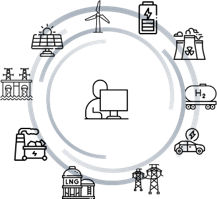

<link rel="preconnect" href="https://fonts.googleapis.com">
<link rel="preconnect" href="https://fonts.gstatic.com" crossorigin>

<link href="https://fonts.googleapis.com/css2?family=Inter:wght@400;500;600&family=Noto+Sans+KR:wght@400;500;700&display=swap" rel="stylesheet">

<!-- Hero Section -->

  

    <h1 style="margin-bottom: 0.2em;">OPEN</h1>
    

      : Optimal Pathway to Energy Transition 
          for Net-zero Energy System
    

    

      OPEN은 장기 전원·송전·저장 계획과 단기 계통 운영을  
      통합적으로 분석하기 위한 전력계통 계획 및 운영 모델입니다.
    

  

  

    
  

<!-- Intro Image -->
<!-- 

  

  

 -->
<!-- Intro Image -->

  
  

<!-- <!-- Quick Links -->

  <h2 style="margin: 0 0 1rem 0;">Go to OPEN</h2>

  

    <!-- Card 1 -->
    

      

        📑
        Overview
      

      

      

        OPEN의 개념과 기능에 대해 확인하세요.
      

      

        <a href="1_Welcome_OPEN/#optimal-pathway-to-energy-transition-for-net-zero-energy-system" style="text-decoration:none; color:#d14;">
          → Introduction
        </a>
        <a href="2_OPEN_concept/#what-is-open" style="text-decoration:none; color:#d14;">
          → Concept
        </a>
      

    

    <!-- Card 2 -->
    

      

        🚀
        Getting started
      

      

      

        OPEN을 사용해보세요.
      

      

        <a href="3_Get_Started/#download-open" style="text-decoration:none; color:#d14;">
          → Installation
        </a>
        <a href="4_user_guide/#how-to-execute-open" style="text-decoration:none; color:#d14;">
          → Quick Start
        </a>
      

    

    

    <!-- Card 3 -->
    

      

        📝
        Release Notes
      

      

      

        최신 기능, 버그 수정, 개선 사항을 릴리즈 노트에서 확인하세요.
      

      <a href="6_release_notes" style="text-decoration:none; color:#d14;">
        → What’s new
      </a>
    

    <!-- Card 4 -->
    

      

        ⚖️
        Open Source
      

      

      

        OPEN은 사단법인 넥스트에서 개발하여 오픈소스로 제공되며 GitHub에서 다운로드 할 수 있습니다.
      

      

        <a href="https://github.com/nextgroup-or-kr/OPEN" style="text-decoration:none; color:#d14;">
          → GitHub for OPEN
        </a>
        <a href="https://nextgroup.or.kr/ko/index" style="text-decoration:none; color:#d14;">
          → NEXTgroup
        </a>
      

    

  

  <!-- Responsive: 모바일에서는 1열로 -->
  

